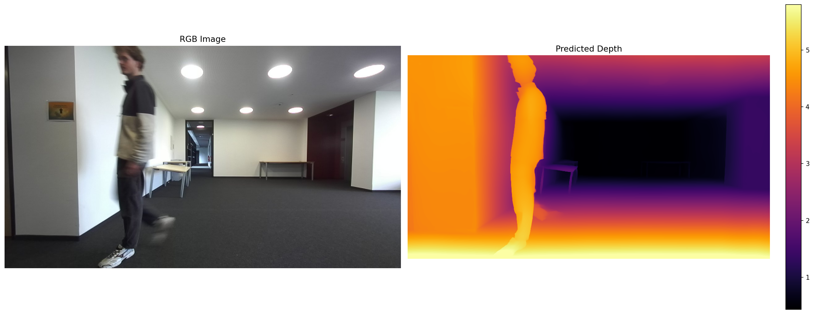
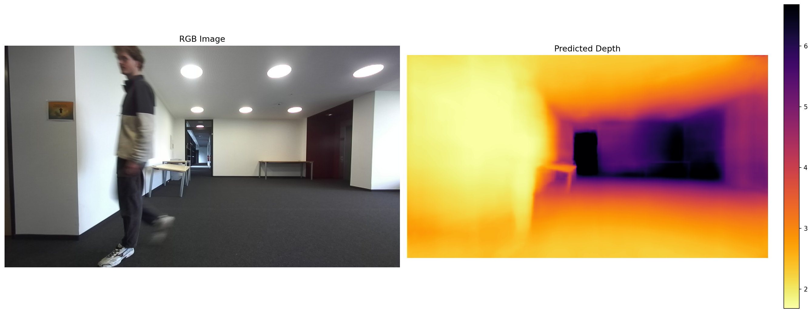
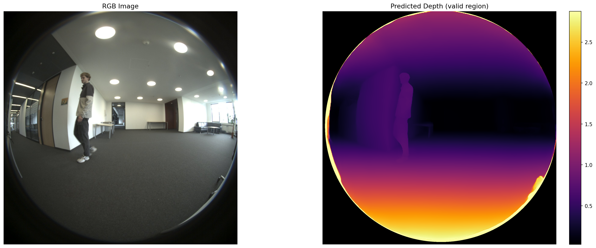
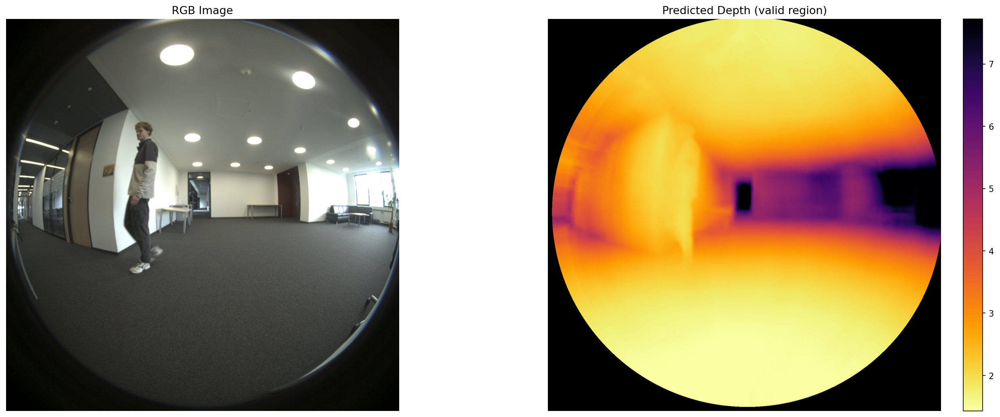

# monocular-depth-estimation

Metric monocular depth, calibrated 3D person localization, and tracking for the
G1_A fisheye camera, evaluated against ZED stereo and two LiDAR sensors.

Detailed instructions and methodology:

- [Experiment and execution guide](docs/EXPERIMENT_GUIDE.md)
- [Camera geometry used by each model](docs/MODEL_GEOMETRY.md)
- [Recording 1 UniDAC full-sequence results](docs/RESULTS_RECORDING1_UNIDAC.md)
- [Recording 1 matched DAC versus UniDAC results](docs/RESULTS_RECORDING1_DAC_VS_UNIDAC.md)
- [All-recording matched DAC versus UniDAC results](docs/RESULTS_ALL_RECORDINGS_DAC_VS_UNIDAC.md)

## Repository structure

```md
monocular-depth-estimation/
├── docs/                       # experiment and geometry documentation
├── notebooks/                  # Colab GPU workflow
├── src/                        # models, geometry, tracking, and evaluation
├── tests/                      # regression tests
├── minutes/
├── references/
├── run_depth.py                # single-frame depth inference
├── run_metric_depth_batch.py   # resumable CUDA/MPS metric-depth batch
├── evaluate_person_tracking.py # 3D person/sensor evaluation
├── compare_evaluation_runs.py  # UniDAC/DAC accuracy report table
├── compare_evaluation_suite.py # weighted multi-recording comparison
├── summarize_lidar_suite.py    # validated perspective/LiDAR aggregation
├── analyze_lidar_outliers.py   # frame ranking and person-blur audit
├── project_lidar_fisheye.py    # calibrated LiDAR-on-G1_A projection
└── benchmark_depth_models.py   # controlled repeated GPU benchmark
```

## Local setup

Install Python 3.12 and `uv`, then create the locked environment:

```bash
uv sync --locked
```

Run commands with `uv run python ...`; manual activation is optional.

### Local Apple Silicon execution

The full metric-depth batch can run from the VS Code terminal on Apple Metal.
`PYTORCH_ENABLE_MPS_FALLBACK=1` lets an unsupported operation fall back to the
CPU while the supported model layers remain on the M1/M2/M3 GPU. For example:

```bash
PYTORCH_ENABLE_MPS_FALLBACK=1 uv run python run_metric_depth_batch.py \
  --data_dir .. \
  --output_dir ../local_experiments/unidac \
  --model UniDAC \
  --recordings recording2 recording3 recording4 \
  --device mps
```

Replace `UniDAC` and the output folder with `DAC` and `dac` for the matched
baseline. The command writes raw metric depth and metadata after every frame;
rerunning it skips completed pairs, so it can resume after sleep or interruption.
Keep the Mac connected to power and prevent system sleep during a long batch.

## Google Colab: matched DAC and UniDAC runs

Use the UniDAC notebook for the newer metric-depth candidate and the DAC
notebook for the established `dac-indoor-resnet101` baseline. Both notebooks
use the same calibrated output and evaluation protocol.

- UniDAC: [](https://colab.research.google.com/github/esthy13/monocular-depth-estimation/blob/unidac-lidar/notebooks/unidac_colab.ipynb)
- DAC baseline: [](https://colab.research.google.com/github/esthy13/monocular-depth-estimation/blob/unidac-lidar/notebooks/dac_colab.ipynb)
- Controlled speed benchmark: [](https://colab.research.google.com/github/esthy13/monocular-depth-estimation/blob/unidac-lidar/notebooks/benchmark_colab.ipynb)

Because this repository is private, an unauthenticated Colab link returns 404.
Open the notebook from Colab's GitHub picker after authorizing private-repository
access, or download the selected notebook while signed in to GitHub and choose
**File → Upload notebook** in Colab.

1. [Create a GitHub token](https://docs.github.com/en/authentication/keeping-your-account-and-data-secure/managing-your-personal-access-tokens)
   that can read this repository. Prefer a fine-grained, expiring token with
   read-only **Contents** permission when available.
2. In Colab's **Secrets** panel (key icon), add it as `GITHUB_TOKEN` and enable
   notebook access. Never paste the token into a code cell.
3. Upload `cv_project_data` to Google Drive.
4. Select **Runtime → Change runtime type → GPU**.
5. Run all cells. The first dependency setup restarts the Python kernel once;
   after Colab reconnects, select **Runtime → Run all** again.
6. Edit `DATA_DIR` and `OUTPUT_DIR` in the notebook's settings cell.
7. Run the one-frame smoke test before enabling its resumable batch cell.

Each notebook pins its official upstream source, caches its model checkpoint in
Drive, uses the calibrated G1_A/ZED_B camera geometry, and saves metric raw depth
(metres), masks, visualizations, and timing/reproducibility metadata. The DAC
notebook also creates the protocol-checked DAC-versus-UniDAC comparison after
both evaluations are available. The batch defaults now target the remaining
full G1_A sequences (`recording2`–`recording4`) without overwriting completed
files, then produces per-recording tables and a weighted four-recording summary.
The dedicated benchmark notebook measures both models sequentially in one GPU
runtime using identical decoded frames, five warm-up runs, and ten timed
repetitions per frame.

## Example outputs

Each visualization shows the input RGB (left) and predicted depth (right).
Depth is colorized so **near = bright, far = dark**. Neutral gray means the
model produced no valid depth there; it is not a far-away surface.

### Perspective camera (ZED_B) — model difference

The same perspective frame with two models. Depth Anything V2 gives the sharpest,
cleanest result (crisp subject and room edges) but in relative units. DAC is
**metric** (metres) and works across camera types, but is softer on standard
pinhole images.

| Depth Anything V2 (relative) | DAC `dac-indoor-resnet101` (metric) |
| --- | --- |
|  |  |

### Fisheye camera (G1_A) — model difference

The same fisheye frame with two models. Depth Anything V2 (relative depth) does
not understand fisheye distortion and gives a flat, roughly radial result with a
faint subject. Depth Any Camera (DAC) is distortion-aware and **metric** (metres),
resolving the standing person and the hallway structure.

| Depth Anything V2 (relative) | DAC `dac-indoor-resnet101` (metric) |
| --- | --- |
|  |  |

**Current baseline:** Depth Anything V2 is the sharp perspective-camera visual
baseline. For calibrated metric G1_A depth, the matched 1,204-frame evaluation
selects UniDAC when 3D localization accuracy is the priority and keeps DAC as
the faster comparison baseline. UniDAC reduces the all-recording mean ZED and
LiDAR 3D errors by 31.5% and 30.5%, while DAC is 2.8 times faster in the
controlled M1 Pro benchmark. See the
[all-recording result](docs/RESULTS_ALL_RECORDINGS_DAC_VS_UNIDAC.md), including
the important UniDAC far-range failure segment in `recording4`.

## Running monocular depth estimation

All commands assume you run from inside `monocular-depth-estimation/`, with the
dataset one level up (so `--data_dir ../` points at the folder holding
`intrinsic.json` and `recording1..4/`).

Each run writes to `outputs/`: an RGB copy (`_rgb.jpg`), a colorized depth
visualization (`_depth.png`), a raw depth array (`_depth_raw.npy`), and — for the
fisheye camera — a binary valid-region mask (`_mask.png`).

### Recommended per camera

```bash
# Perspective camera (ZED_B) — Depth Anything V2 gives the sharpest result
uv run python run_depth.py --data_dir ../ --sensor ZED_B --recording recording1 --image_index 0

# Fisheye camera (G1_A) — calibrated metric DAC baseline with a fixed report scale
uv run python run_depth.py --data_dir ../ --sensor G1_A --recording recording1 --image_index 0 --model dac --variant dac-indoor-resnet101 --visualization_range 0.5 10.0
```

> **Note on units.** Depth Anything V2 outputs *relative* (inverse) depth in
> arbitrary units. DAC outputs *metric* depth in metres — use it when you need
> real distances for 3D projection / LiDAR comparison. UniDAC also outputs
> metric depth in metres.

### Hugging Face authentication

Model downloads use `HF_TOKEN` when it is set in the shell or in the project's
git-ignored `.env` file. For example: `HF_TOKEN=hf_your_token`. The token is
used for both Transformers and direct Hugging Face Hub downloads, and is never
printed.

## LiDAR ground-truth evaluation (perspective camera)

`run_depth.py` can timestamp-match a LiDAR cloud, transform its points into the
perspective camera frame, project the visible points using the calibrated OpenCV
intrinsics (including distortion), and compare the model at those pixels.

```bash
uv run python run_depth.py --data_dir ../ --sensor ZED_B --recording recording1 \
  --image_index 0 --evaluate_lidar --lidar_sensor YOUR_LIDAR_SENSOR
```

For a recording-level result, add `--evaluate_lidar_all`. It evaluates every
RGB frame with a LiDAR timestamp match, skips unmatched frames, and writes
`recording1_ZED_B_YOUR_LIDAR_SENSOR_lidar_global_metrics.json`. The global file
combines the per-frame evaluations by LiDAR-point count without refitting an
additional global alignment; per-frame metrics and diagnostic files are also
saved.

```bash
PYTORCH_ENABLE_MPS_FALLBACK=1 uv run python run_depth.py \
  --data_dir .. \
  --output_dir ../local_experiments/perspective/unidac/recording1 \
  --sensor ZED_B \
  --recording recording1 \
  --model unidac \
  --device mps \
  --evaluate_lidar_all \
  --lidar_sensor E1_A \
  --alignment none
```

Replace `YOUR_LIDAR_SENSOR` with the sensor key used both in
`extrinsics.json` and in `recording1/data/` (for example, an Ouster/LiDAR
folder name). The default assumes each extrinsic maps **sensor → G1_A**. If
your calibration stores the inverse direction, add:

```bash
--extrinsics_convention reference_to_sensor
```

The run writes three additional files alongside the depth output:

- `_lidar_projection.png`: RGB image with the nearest projected LiDAR return
  per pixel, coloured by LiDAR depth. This is the primary calibration sanity
  check—points should land on their corresponding image structures.
- `_lidar_metrics.json`: count, alignment parameters, MAE, RMSE, AbsRel,
  SqRel, log-RMSE, and the standard δ<1.25 / δ<1.25² / δ<1.25³ accuracies.
- `_lidar_samples.csv`: pixel coordinates and each LiDAR/predicted depth pair,
  for plotting or further analysis.

Depth Anything V2 is not metrically scaled. For it, the default `--alignment
auto` takes the reciprocal of its inverse-depth output and estimates a
least-squares scale against the sampled LiDAR depths **before** calculating
errors. This is a **per-frame, LiDAR-aligned** score, not a zero-shot metric-depth
score. Use `--alignment median` for median scaling or `--alignment none` only
for a model that already outputs metres (such as DAC or UniDAC). Record the
selected alignment with every result; fitting and testing on the same sparse
points is useful for evaluating shape/relative-depth quality but is optimistic
for metric-depth claims.

After running all recordings, validate the protocol and calculate a correctly
point-weighted suite result:

```bash
uv run python summarize_lidar_suite.py \
  --results_root ../local_experiments/perspective/unidac \
  --output_dir ../local_experiments/perspective/analysis \
  --recordings recording1 recording2 recording3 recording4 \
  --sensor ZED_B \
  --lidar_sensor E1_A \
  --model UniDAC \
  --expected_alignment none
```

To rank error outliers and test whether person blur is associated with higher
error, run:

```bash
uv run python analyze_lidar_outliers.py \
  --data_dir .. \
  --results_root ../local_experiments/perspective/unidac \
  --output_dir ../local_experiments/perspective/analysis \
  --recordings recording1 recording2 recording3 recording4 \
  --sensor ZED_B \
  --lidar_sensor E1_A \
  --person_blur \
  --device mps
```

The blur analysis uses variance of the Laplacian inside eroded YOLO person
masks. Lower values mean less person detail. Its Spearman correlation tests an
association with error; it does not establish blur as the cause.

## LiDAR projection (fisheye camera)

`project_lidar_fisheye.py` timestamp-matches one or both E1 LiDARs, transforms
their finite XYZ returns into the G1_A reference frame, and projects them with
the calibrated OpenCV fisheye camera matrix and distortion coefficients. It
uses Euclidean camera range and keeps the nearest return at each image pixel.

```bash
uv run python project_lidar_fisheye.py \
  --data_dir .. \
  --output_dir ../local_experiments/fisheye_lidar_projection/recording1 \
  --recording recording1 \
  --image_index 0 \
  --lidar_sensors E1_A E1_B \
  --lidar_max_dt 0.05 \
  --visualization_range 0.5 10.0
```

Add `--all_frames` for a recording batch; `--frame_step` and `--max_frames`
can select a review subset. The command is resumable and refuses to mix
existing outputs created with different sensors, timestamp settings, distance
limits, color scales, or extrinsics conventions unless `--overwrite` is used.

Every frame produces:

- `_projection.png`: RGB and fixed-scale LiDAR overlay with a range colorbar;
- `_points.csv`: visible sensor, subpixel coordinates, and Euclidean range;
- `_metadata.json`: exact timestamps, offsets, calibration matrices,
  transforms, counts, scale, convention, and project revision.

The recording summary reports matches, timestamp statistics, and projected
point counts per LiDAR. When both LiDARs are shown together, viewpoint-dependent
occlusion shadows can differ; run `--lidar_sensors E1_A` and `E1_B` separately
when validating each calibration.

### Depth Anything V2 (default model)

```bash
# Perspective camera, first frame
uv run python run_depth.py --data_dir ../ --sensor ZED_B --recording recording1 --image_index 0

# Fisheye camera (auto circular valid-region masking)
uv run python run_depth.py --data_dir ../ --sensor G1_A --recording recording1 --image_index 0

# Larger encoder (sharper, slower)
uv run python run_depth.py --data_dir ../ --sensor ZED_B --encoder large
```

### Depth Any Camera (DAC) — metric depth, native fisheye support

DAC ([Guo et al., CVPR 2025](https://github.com/yuliangguo/depth_any_camera))
gives zero-shot **metric** depth and handles fisheye intrinsics natively.
One-time setup (clone the repo; weights download from HuggingFace on first run,
~700 MB, cached afterwards):

```bash
git clone https://github.com/yuliangguo/depth_any_camera.git third_party/depth_any_camera
```

The compiled deformable-attention C++ op is **not** required (the ResNet101
configs use `attn_dec=false`); it is mocked automatically.

```bash
# Fisheye, indoor ResNet101  (recommended for this dataset)
uv run python run_depth.py --data_dir ../ --sensor G1_A --recording recording1 --image_index 0 --model dac --variant dac-indoor-resnet101

# Perspective, indoor ResNet101
uv run python run_depth.py --data_dir ../ --sensor ZED_B --recording recording1 --image_index 0 --model dac --variant dac-indoor-resnet101

# Indoor SwinL backbone (heavier; can show artifacts at the fisheye periphery)
uv run python run_depth.py --data_dir ../ --sensor G1_A --recording recording1 --image_index 0 --model dac --variant dac-indoor-swinl

# Outdoor ResNet101 (KITTI-trained; overestimates indoor distances)
uv run python run_depth.py --data_dir ../ --sensor G1_A --recording recording1 --image_index 0 --model dac-outdoor-resnet101
```

Available variants: `dac-indoor-resnet101`, `dac-indoor-swinl`,
`dac-outdoor-resnet101`, `dac-outdoor-swinl`.

### UniDAC — metric depth, Colab GPU recommended

The Colab notebook above installs the pinned official source and checkpoint.
For the circular G1_A lens, the adapter expands UniDAC's rectangular ERP crop
to cover the full vertical fisheye field of view and masks the black lens border
before inference. The saved metadata records the effective ERP crop and FoV.
For later sensor/model evaluation, `create_common_valid_depth_mask()` builds the
intersection mask so every error metric uses exactly the same aligned pixels.
After the same setup is available locally, the single-frame CLI also accepts:

```bash
uv run python run_depth.py --data_dir ../ --sensor G1_A --recording recording1 --image_index 0 --model unidac
```

## 3D person tracking and physical-sensor evaluation

After generating a G1_A metric-depth batch, run the automated evaluator:

```bash
uv run python evaluate_person_tracking.py \
  --data_dir .. \
  --depth_output_dir /path/to/cv_project_outputs/unidac \
  --output_dir outputs/evaluation/recording1 \
  --recording recording1 \
  --frame_step 10 \
  --max_frames 50
```

The evaluator uses the COCO-pretrained
[YOLO26 instance-segmentation model](https://docs.ultralytics.com/tasks/segment/)
for person masks and [ByteTrack](https://docs.ultralytics.com/modes/track/) for
persistent IDs. For every tracked person it:

1. takes robust metric model depth inside an eroded instance mask;
2. converts the mask centroid and Euclidean ray depth to G1_A camera-frame XYZ;
3. reprojects the closest ZED_B depth image through the calibrated extrinsics;
4. reprojects the two closest LiDAR sweeps and rejects returns inconsistent
   with the stereo-visible foreground, avoiding cross-sensor occlusion errors;
5. computes common-pixel MAE, RMSE, absolute-relative error, bias, and 3D error.

Outputs are written to the evaluation directory:

- `person_measurements.csv`: one row per detected person and frame;
- `track_summary.csv`: aggregate measurements per persistent track ID;
- `evaluation_summary.json`: run configuration, versions, counts, and averages;
- `annotated/`: masks, boxes, IDs, and model/ZED/LiDAR distances.

The updated Colab notebook exposes the same workflow in its optional final
section and caches `yolo26n-seg.pt` in Google Drive.

To compare evaluation summaries from UniDAC and DAC using the same protocol:

```bash
uv run python compare_evaluation_runs.py \
  --run UniDAC=/path/to/unidac/evaluation_summary.json \
  --run DAC=/path/to/dac/evaluation_summary.json \
  --output_markdown outputs/evaluation/model_comparison.md
```

See the [experiment guide](docs/EXPERIMENT_GUIDE.md) for the complete sampling,
timing, visualization, and reporting protocol.

## All depth-estimation options

```bash
uv run python run_depth.py \
  --data_dir ../ \
  --sensor {ZED_B|G1_A} \           # perspective | fisheye
  --recording recording1 \         # recording1..4
  --image_index 0 \                # frame index
  --model {depth_anything_v2|dac|unidac} \
  --variant dac-indoor-resnet101 \ # only with --model dac
  --encoder {small|base|large} \   # only for depth_anything_v2
  --fisheye_mask {auto|none} \     # auto-masks the lens circle on fisheye
  --invalid_value {nan|zero} \     # value written to masked pixels
  --visualization_range 0.5 10.0   # shared report scale; optional
```

- Omit `--model` to use the default `depth_anything_v2`.
- `--variant` applies only when `--model dac`; `--encoder` only for Depth Anything V2.
