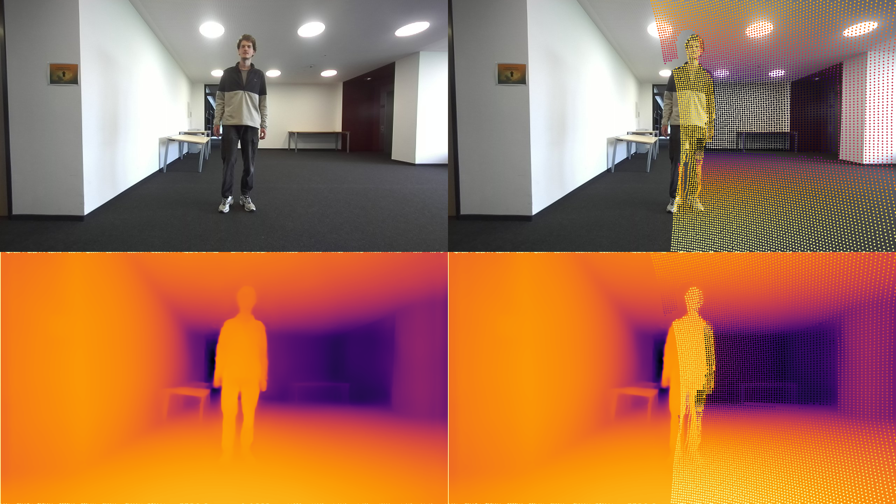
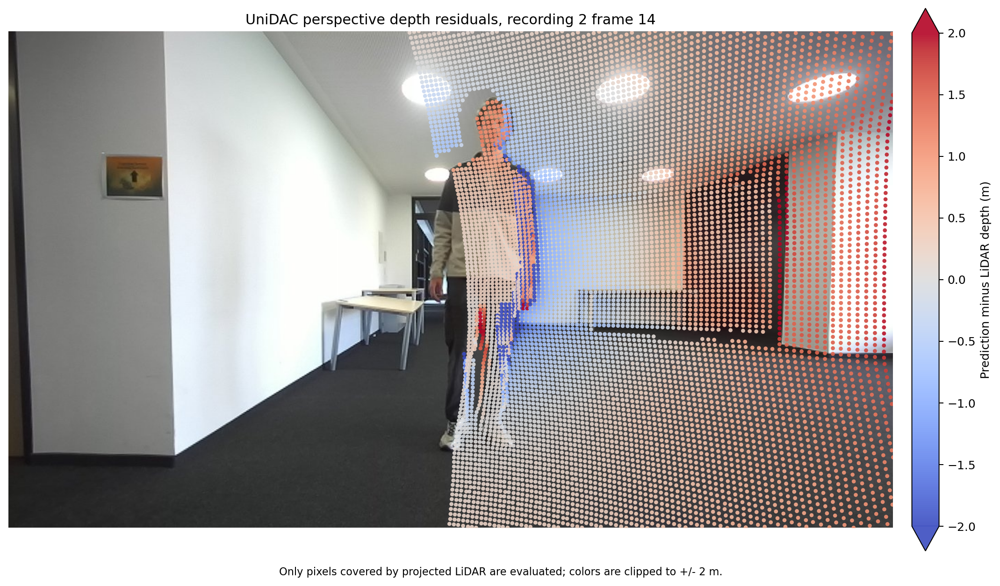
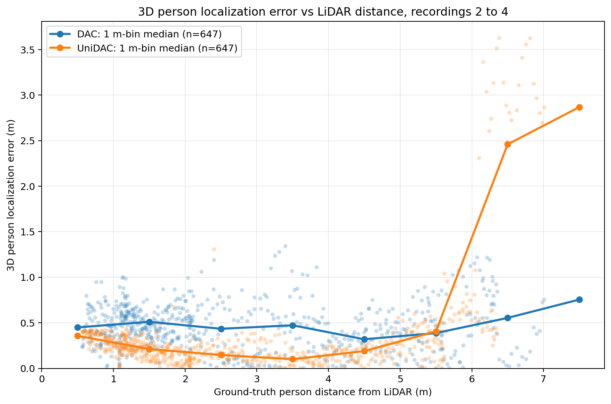

# Project update: monocular depth and 3D person localization

**Date:** 2 September 2026
**Suggested subject:** Project update: monocular depth and 3D person localization

Dear Christopher,

Here is a short update on our monocular depth and 3D person localization work.
We evaluated Depth Anything V2, DAC, and UniDAC against projected LiDAR points
for the ZED_B perspective camera. We also completed the person tracking and 3D
localization comparison between DAC and UniDAC for the G1_A fisheye camera.

## Perspective camera depth comparison

We first inspected three representative frames from recording 2: a blurred
person, a sharp person, and a static scene without a person. The table shows
MAE and AbsRel against the projected LiDAR points.

| Frame | Depth Anything V2, oracle aligned | DAC | UniDAC |
| --- | ---: | ---: | ---: |
| Blurred person | 1.351 m / 0.262 | 1.637 m / 0.299 | **1.188 m / 0.229** |
| Sharp person | 0.321 m / 0.076 | 0.862 m / 0.218 | **0.646 m / 0.179** |
| Static scene | 0.105 m / 0.016 | 0.961 m / 0.214 | **0.587 m / 0.140** |

Each entry is MAE / AbsRel. Among the two direct metric models, UniDAC performs
better than DAC on all three examples. It also handles the blurred person more
accurately. Depth Anything V2 performs especially well on the sharp and static
examples after alignment, but it produces relative depth. Its scale and shift
were fitted separately on each evaluated frame using that frame's LiDAR points,
so these values measure depth shape after oracle alignment, not independent
metric accuracy.

The following UniDAC example shows the RGB image and projected LiDAR points in
the top row, followed by the metric-depth prediction and LiDAR overlay in the
bottom row. The LiDAR has a narrower field of view than the camera, which is why
the projected points cover only the right part of the image. The uncovered area
does not indicate missing or invalid model depth. We calculate the LiDAR metrics
only at pixels with a valid projected LiDAR reference.

Following your suggestion, we also created a signed residual overlay. Each
point is coloured by `predicted depth - LiDAR depth`. Blue means UniDAC predicts
the surface closer than the LiDAR return, red means farther, and white means
agreement. Values outside the fixed -2.0 to +2.0 m colour range are clipped.
The absence of points on the left is caused by the narrower LiDAR field of view,
not missing model predictions.

The camera and LiDAR timestamps are matched within 50 ms. Their residual time
difference has a standard deviation of about 26 ms across the four recordings.
Motion blur, remaining synchronization differences, and the different sensor
viewpoints can therefore increase the error around moving people.

## Fisheye camera person localization

For the fisheye pipeline, DAC and UniDAC both receive the calibrated intrinsics
and distortion parameters and return metric distance. We use YOLO26 for person
masks, ByteTrack for persistent IDs, and the median depth inside each person
mask to calculate a 3D point in the G1_A camera coordinate system.

We evaluated both models on the same 1,204 frames and 1,005 person detections
from four recordings. There were 725 valid LiDAR references per model. We
matched the sensors by timestamp and used stereo depth to reduce errors caused
by their different viewpoints.

The detection and tracking results were identical for both models, so the
comparison isolates the depth estimation. In recording 1, there were no ID
changes while the person remained visible. The person had one ID in frames 0
to 60 and a new ID in frames 97 to 132 after a long absence, which is expected
re-entry behavior.

| Recording | DAC mean LiDAR 3D error | UniDAC mean LiDAR 3D error |
| --- | ---: | ---: |
| Recording 1 | 0.595 m | 0.312 m |
| Recording 2 | 0.542 m | 0.191 m |
| Recording 3 | 0.486 m | 0.249 m |
| Recording 4 | 0.321 m | 0.717 m |
| **All recordings, weighted** | **0.475 m** | **0.330 m** |

Overall, UniDAC reduced the mean LiDAR 3D localization error by **30.5%**
compared with DAC. It performed better in recordings 1 to 3. Recording 4 was
the exception. In 24 frames, UniDAC had more than 1 m error and placed the
person at about 8.4 to 10.4 m, while LiDAR measured 6.1 to 7.0 m. We will
investigate and report this far range failure.

The following plot uses all 647 valid person/LiDAR matches per model from
recordings 2 to 4. Each translucent point is one detection. The solid lines
show median 3D localization error in 1 m ground-truth distance bins. UniDAC has
lower median error through most of the measured range, while its recording 4
failure appears as the sharp increase beyond approximately 6 m.

In our controlled M1 Pro benchmark, DAC took 390 ms per frame, or 2.56 FPS,
while UniDAC took 1,087 ms, or 0.92 FPS. DAC was about 2.8 times faster.

Our current conclusion is to use UniDAC as the accuracy-focused model and DAC
as the faster baseline for direct metric depth. For Depth Anything V2, a fair
metric comparison would fit one fixed calibration on separate frames and then
evaluate it on held-out frames. We treat LiDAR as a physical reference rather
than perfect ground truth because calibration, synchronization, and viewpoint
differences can also affect the error.

Our next steps are to investigate the UniDAC far-range failure in recording 4,
inspect the effect of blur and synchronization on the perspective results, and
prepare the final report evaluation. We would be glad to hear whether this
covers the main points you would like us to prioritize.

Best regards,  
Esther Giuliano and Fazel Malekian

Detailed results are available in the
[all-recording DAC and UniDAC evaluation](RESULTS_ALL_RECORDINGS_DAC_VS_UNIDAC.md).
