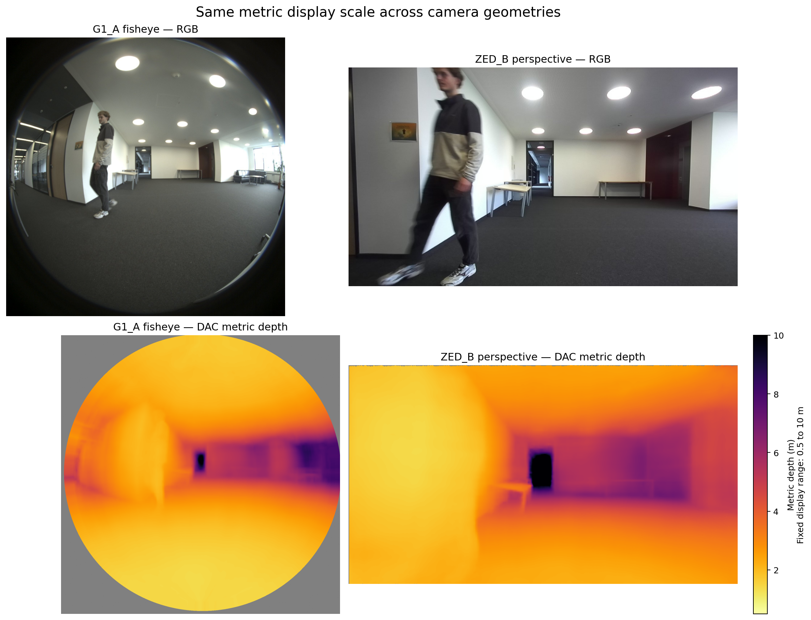

# Depth visualization scale

## Decision

Camera geometry does not determine the color scale. DAC and UniDAC produce
metric Euclidean ray distance in metres for both the G1_A fisheye camera and
the ZED_B perspective camera. Their plots therefore use one shared fixed range:

```text
0.5 m to 10.0 m
```

The same color consequently represents the same physical distance in both
camera views. Values outside the range are clipped only for display; the raw
depth arrays and evaluation metrics are unchanged. Invalid pixels, including
the area outside the fisheye lens, are gray and do not affect the scale.



## Model-specific policy

| Output | Quantity and unit | Plot range | Cross-camera color comparison |
| --- | --- | --- | --- |
| DAC or UniDAC on G1_A | Metric Euclidean ray distance (m) | Fixed 0.5-10.0 m | Yes |
| DAC or UniDAC on ZED_B | Metric Euclidean ray distance (m) | Fixed 0.5-10.0 m | Yes |
| Projected LiDAR range | Euclidean sensor range (m) | Fixed 0.5-10.0 m when shown beside metric depth | Yes, when the physical quantity matches |
| Depth Anything V2 | Relative inverse-depth proxy (a.u.) | Per-image valid-pixel 2nd-98th percentiles | No; neither colors nor values are metric |

Every generated colorbar now states:

- the represented quantity;
- the unit (`m` or `a.u.`);
- whether the range is fixed or computed per image; and
- the exact lower and upper display limits.

For metric models, `run_depth.py` uses 0.5-10.0 m when no override is supplied.
The DAC and UniDAC Colab notebooks use the same fixed range. A different range
may be selected with `--visualization_range MIN MAX`, but it must be held fixed
across every metric plot in that comparison and reported in the caption.

Depth Anything V2 is deliberately separate. Its output grows as objects become
nearer, but it has no metre scale. Its per-image robust range improves visual
contrast, while the `a.u.` label and exact limits prevent it from being mistaken
for a metric comparison. A Depth Anything V2 color must never be compared
numerically with a DAC, UniDAC, stereo-depth, or LiDAR color.

## Report-ready wording

> All metric depth images were visualized with a shared fixed color range of
> 0.5-10.0 m for both the G1_A fisheye and ZED_B perspective cameras. Therefore,
> identical colors denote identical physical distances independent of camera
> geometry. Values outside this interval were clipped for visualization only,
> while invalid pixels were rendered in gray and excluded from scale
> calculation. Depth Anything V2 outputs a relative inverse-depth proxy rather
> than metric depth; those images used a separately labelled per-image
> 2nd-98th-percentile range in arbitrary units and were not compared
> quantitatively by color with the metric outputs.

The figure caption should include: **near = bright, far = dark; gray = invalid;
fixed metric display range = 0.5-10.0 m**.
